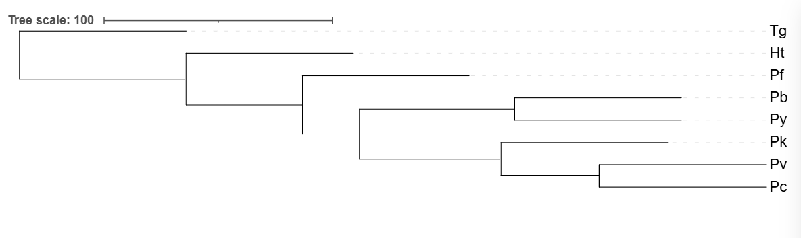

# **Case Study: The origin of human malaria**
## 1. Background
 
Malaria is caused by parasites belonging to the phylum Apicomplexa. The genus *Plasmodium* infects not only humans but also other mammals, birds, and reptiles. *Plasmodium falciparum* is responsible for the most severe human malaria infections worldwide.
 
A long-standing scientific controversy concerns whether *P. falciparum* is more closely related to other mammalian *Plasmodium* species, or whether it originated from an avian malaria parasite that switched hosts. The first genome of an avian malaria parasite — *Haemoproteus tartakovskyi* — was recently sequenced, enabling a comprehensive phylogenetic analysis to address this question.
 
---
 
## 2. Organisms
 
| Species | Abbreviation | Host |
|---|---|---|
| *Plasmodium berghei* | Pb | Rodent |
| *Plasmodium cynomolgi* | Pc | Macaques |
| *Plasmodium falciparum* | Pf | Humans |
| *Plasmodium knowlesi* | Pk | Lemurs |
| *Plasmodium vivax* | Pv | Humans |
| *Plasmodium yoelii* | Py | Rodents |
| *Haemoproteus tartakovskyi* | Ht | Birds (avian malaria) |
| *Toxoplasma gondii* | Tg | Humans **(outgroup)** |
 
> **Note:** *Toxoplasma gondii* is used as the outgroup for rooting the phylogenetic tree.
 
---
 
## 3. Databases
 
- **NCBI Taxonomy Database** — `ftp://ftp.ebi.ac.uk/pub/databases/taxonomy/taxonomy.dat`
- **SwissProt Database** — `ftp://ftp.uniprot.org/pub/databases/uniprot/current_release/knowledgebase/complete/uniprot_sprot.dat.gz`
 
Download with `wget` in Bash prior to running the pipeline.
 
---
 
## 4. Pipeline Workflow
 
The pipeline consists of five major stages.
 
### Stage 1 — Preprocessing: *Haemoproteus tartakovskyi*
 
The raw *H. tartakovskyi* assembly contains both parasite and avian host genomic content, which must be removed before analysis.
 
- **GC-content filtering** (`removeScaffold.py`): Scaffolds with GC content below 25% and shorter than 3,000 bp are discarded (Bensch et al., 2016).
- **Initial gene prediction** (`Ht_genepred.sh`): GeneMark (`gmes_petap.pl`) is run in self-training (`--ES`) mode on the GC-filtered genome.
- **GTF cleaning and CDS extraction** (`Ht_gffParse.sh`): The GeneMark GTF is cleaned with `sed`, then `gffParse.pl` extracts nucleotide (`.fna`) and protein (`.faa`) FASTA files.
- **BLASTX-based host removal** (`Ht_Blast.sh`): Predicted proteins are queried against SwissProt (E-value ≤ 1×10⁻¹⁰). `datParser.py` identifies scaffolds whose top BLAST hits match avian taxa in the NCBI taxonomy; `removeBirdScaffold.py` removes these scaffolds to produce the cleaned genome (`Ht_clean.fasta`).
- **Re-prediction on cleaned genome** (`cleanHt_genePred.sh`): GeneMark is re-run on the cleaned assembly and `gffParse.pl` extracts final CDS sequences.
 
### Stage 2 — Gene Prediction: Remaining Species
 
For Pb, Pc, Pf, Pk, Pv, Py, and Tg, GeneMark is run for gene prediction in the same manner. `gffParse.pl` then extracts `.faa` and `.fna` files for each genome.
 
### Stage 3 — Ortholog Identification
 
- **Proteinortho** (`proteinortho.sh`): Proteinortho6 identifies orthologous gene groups across all eight `.faa` files.
- **BUSCO** (`BUSCO.sh`): BUSCO (v6, `apicomplexa_odb10` lineage) assesses gene completeness and identifies conserved single-copy orthologs in protein mode for each species.
 
### Stage 4 — Multiple Sequence Alignment
 
- **BUSCO ID extraction** (`Extract_comp_dup.sh`): Complete and first-occurrence Duplicated BUSCO IDs are extracted from each species' `full_table.tsv`, producing one `_one_to_one_id.tsv` file per species (columns: BUSCO ID, gene ID).
- **BUSCO ID table merging** (`concatenate.R`): The eight per-species TSV files are merged by BUSCO ID into a single `concatenated_ids.tsv` table (columns: `BUSCOID, Ht, Pb, Pc, Pf, Pk, Pv, Py, Tg`). Only BUSCO IDs present across all eight species are retained.
- **Per-BUSCO FASTA extraction** (`extractfaa.py`): Using `concatenated_ids.tsv` as a lookup table, protein sequences are retrieved from each species' `.faa` file and written to one FASTA file per BUSCO ID (8 sequences per file).
- **MSA** (`clustal.sh`): Clustal Omega aligns each per-BUSCO FASTA file using 20 CPU threads, producing one alignment file per BUSCO ID.
 
### Stage 5 — Phylogenetic Analysis
 
- **Per-gene trees** (`ramkl.sh`): RAxML (`raxmlHPC-PTHREADS`) constructs a maximum-likelihood tree for each alignment under the `PROTGAMMABLOSUM62` model, rooted on *T. gondii*.
- **Consensus tree**: All per-locus outtrees are combined and PHYLIP computes a final consensus tree across all BUSCO loci.
 
---
 
## 5. Scripts Overview
 
| Script | Language | Purpose |
|---|---|---|
| `removeScaffold.py` | Python | Filter genome by GC content and minimum scaffold length |
| `removeBirdScaffold.py` | Python | Remove scaffolds identified as avian host contamination |
| `datParser.py` | Python | Parse BLAST output + UniProt DAT file to identify avian scaffold IDs |
| `Ht_genepred.sh` | Bash | GeneMark gene prediction on GC-filtered Ht genome |
| `Ht_gffParse.sh` | Bash | GTF preprocessing and CDS/protein extraction for Ht |
| `Ht_Blast.sh` | Bash | BLASTX against SwissProt; call datParser + removeBirdScaffold |
| `cleanHt_genePred.sh` | Bash | GeneMark re-prediction and gffParse on cleaned Ht genome |
| `proteinortho.sh` | Bash | Run Proteinortho6 on all `.faa` files |
| `BUSCO.sh` | Bash | BUSCO assessment for each species in protein mode |
| `Extract_comp_dup.sh` | Bash | Extract one-to-one BUSCO ortholog IDs per species |
| `extractfaa.py` | Python | Build per-BUSCO FASTA files from species protein files |
| `clustal.sh` | Bash | Clustal Omega MSA for each BUSCO FASTA file |
| `ramkl.sh` | Bash | RAxML maximum-likelihood tree per BUSCO alignment |
| `concatenate.R` | R | Merge per-species BUSCO ID tables into a single `concatenated_ids.tsv` for all 8 species |
 
---
 
## 6. Directory Structure
 
```
project/
├── resources/
│   ├── genome/           # Raw and cleaned genome FASTA files
│   ├── database/         # taxonomy.dat, uniprot_sprot.dat
│   └── busco_downloads/  # BUSCO lineage datasets
├── results/
│   ├── 01_gene_pred/     # GeneMark .gtf files and logs
│   ├── 02_CDS/           # .faa and .fna per species
│   ├── 03_Blast/         # BLASTX output, scaffold lists
│   ├── 04_proteinortho/  # Proteinortho6 output
│   ├── 05_Busco/         # BUSCO results per species + IDs
│   ├── 06_BuscoIdfa/     # Per-BUSCO FASTA files
│   ├── 07_clustal/       # Multiple sequence alignments
│   └── 08_ramkl/         # Per-locus RAxML trees
├── scripts/              # All pipeline scripts
└── README.md             # This file
```
 
---
 
## 7. Software Requirements
 
All tools are managed through Conda environments for reproducibility.
 
| Tool | Version | Purpose |
|---|---|---|
| Python | 3.12.10 | Scripting (datParser, extractfaa, removeScaffold, etc.) |
| BLAST+ | 2.17.0 | BLASTX against SwissProt for host detection |
| GeneMark | — | Ab initio gene prediction (`gmes_petap.pl`) |
| gffParse.pl | — | CDS/protein extraction from GTF annotations |
| Proteinortho | 6.3.6 | Ortholog group prediction |
| BUSCO | 6.0.0 | Single-copy ortholog assessment |
| Clustal Omega | 1.2.4 | Multiple sequence alignment |
| RAxML | 8.2.13 | Maximum-likelihood phylogenetic trees |
| R / PHYLIP | — | Tree concatenation and consensus |
| Biopython | — | FASTA parsing in `extractfaa.py` |
 
---
 
## 8. Key Outputs
 
- GeneMark `.gtf` annotation files for each genome
- `.faa` (protein) and `.fna` (nucleotide) CDS files per genome
- BLASTX results and bird scaffold list for Ht
- Proteinortho6 ortholog groups
- BUSCO assessment results per species
- Per-BUSCO multiple sequence alignments (Clustal Omega)
- Per-locus maximum-likelihood trees (RAxML)
- Final consensus phylogenetic tree (PHYLIP)
 
---

## 9. Result
 

 
The consensus phylogenetic tree shows *Haemoproteus tartakovskyi* (Ht) grouping with *Plasmodium falciparum* (Pf) as a distinct clade, separate from the other mammalian *Plasmodium* species, with *Toxoplasma gondii* (Tg) correctly placed as the outgroup. This topology supports the hypothesis that *P. falciparum* shares a closer evolutionary origin with the avian malaria parasite rather than with the other mammalian *Plasmodium* species.

---

## 10. Reference
 
Bensch S, et al. (2016). The origin and diversification of *Haemoproteus* parasites. *(Context: GC-content threshold for host-genome separation.)*
## **People Involved:**
* **Name:** Karnesh Sampath, Dag Ahren (Professor), Mirjam Müller (Phd), Eleni Theofania Skorda (Phd)
* **Date:** 02.03.2025

---

> **Note:**
> * The working directory structure described above can be followed by the user but the resources and result data were not included due to large space


